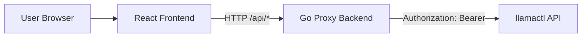

# Architecture Overview

## Purpose

llamactl-console is a management UI for llamactl that keeps the upstream management API key out of the browser.

The frontend talks only to a local proxy backend. The proxy backend authenticates users, applies policy, and forwards approved requests to llamactl.

## MVP Scope

Included:
- Instances management
  - List/get/create/update/delete instances
  - Start/stop/restart instances
  - View instance logs
- API key management
  - List/get/create/delete keys
  - View key permissions
- User management and login
  - Local username/password login
  - JWT access tokens and refresh token rotation
  - Initial admin bootstrap at first startup

Not in MVP:
- Model cache/download workflows
- Nodes/system dashboards
- OpenAI proxy UI
- Advanced backend command parsing UX

## Architecture Goals

- Security: Never expose the upstream management key to browser clients.
- Separation: Keep UI concerns separate from upstream integration and policy enforcement.
- Extensibility: Support migration from simple local auth to JWT/OAuth without breaking frontend APIs.
- Operability: Keep local development simple and production deployment reproducible.

## System Context



## Core Components

### Frontend (React + shadcn UI)

Responsibilities:
- Render management pages and forms.
- Call proxy endpoints only.
- Handle loading, empty, and error states.
- Keep auth/session state for logged-in users.

Non-responsibilities:
- Storing or sending upstream management credentials.
- Direct calls to llamactl.

### Backend (Go Proxy)

Responsibilities:
- Authenticate app users.
- Authorize allowed actions.
- Forward approved API calls to llamactl without rewriting route paths.
- Add upstream `Authorization: Bearer <management-key>` header from server-side configuration.
- Normalize upstream errors into stable frontend-safe responses.
- Emit structured logs and health endpoints.

Non-responsibilities:
- Re-implementing llamactl business logic.
- Persisting model or instance state outside required app auth/session data.

### Upstream (llamactl)

Responsibilities:
- Manage instances, keys, models, nodes, and system behavior.
- Enforce upstream key-based access control.

## Trust Boundaries

Boundary 1: Browser <-> Proxy
- User-facing auth/session boundary.
- CORS restricted to known frontend origin.
- Optional CSRF protection when cookie-based session auth is used.

Boundary 2: Proxy <-> llamactl
- Machine-to-machine trust using management API key.
- Key lives only in backend runtime environment.
- Outbound timeouts and retries controlled by proxy.

## Authentication and Authorization Strategy

Current direction:
- Per-user auth at proxy layer.
- Local JWT auth for MVP (self-hosted friendly).
- Role-based authorization in backend handlers (for example `admin`, `operator`, `viewer`).

JWT model for MVP:
- Short-lived access token for API calls.
- Longer-lived refresh token with rotation and revocation support.
- Tokens signed with server-managed secret key.
- Refresh tokens persisted server-side (hashed) for revocation and audit.

Future direction:
- Swap identity provider to JWT/OAuth without changing frontend route contracts.
- Preserve same authorization checks in backend handlers.

### Startup Admin Bootstrap

At server startup, if no users exist:
- Generate a cryptographically secure random admin password.
- Create a default `admin` account with that password (stored as password hash only).
- Emit the password once as a bootstrap secret and instruct immediate password change.
- Mark account state as "must rotate password" before regular use.

Operational safeguards:
- Never persist plaintext bootstrap password in database.
- Redact bootstrap password from structured logs after initial one-time output.
- Allow optional override via environment variable for fully automated installs.
- Fail startup if password generation source is unavailable.

## API Design Principles

- Prefix all proxy endpoints under `/api`.
- Keep proxy paths identical to upstream paths where possible (no per-route translation layer).
- Translate upstream errors (400/404/409/500) into consistent error envelope.
- Pass through only required headers and request bodies.
- Reserve only operational endpoints such as `/api/health*`; forward other `/api/*` routes as-is.

Example endpoint groups:
- `/api/v1/*` (proxied to upstream with unchanged path)
- `/api/health`

## Request Flow Examples

### Start Instance

1. Frontend sends `POST /api/v1/instances/{name}/start` to proxy.
2. Proxy authenticates user and checks authorization.
3. Proxy forwards the same method, path, and query to llamactl with `Authorization: Bearer <management-key>`.
4. Proxy returns normalized response to frontend.

### Create API Key

1. Frontend sends `POST /api/v1/auth/keys` with key options.
2. Proxy validates request and user permission.
3. Proxy forwards the same method, path, and query to llamactl with `Authorization: Bearer <management-key>`.
4. Proxy returns created key metadata to frontend.

## Deployment Topology

### Development

- Frontend and backend run as separate processes.
- Frontend uses local dev server and proxies API calls to backend origin.
- Backend reads local environment variables for upstream target and management key.

### Production-like Local/CI

- Run frontend + backend (and optional local llamactl) with docker-compose.
- Pin explicit service-to-service network aliases and ports.

## Configuration

Expected backend configuration variables:
- `PORT`: Proxy listen port.
- `LLAMACTL_BASE_URL`: Upstream llamactl base URL.
- `LLAMACTL_MANAGEMENT_API_KEY`: Upstream management key (secret).
- `APP_JWT_SIGNING_KEY`: Signing key for JWT access and refresh tokens.
- `APP_JWT_ACCESS_TTL`: Access token lifetime (for example `15m`).
- `APP_JWT_REFRESH_TTL`: Refresh token lifetime (for example `7d`).
- `BOOTSTRAP_ADMIN_USERNAME`: Optional initial admin username override (default `admin`).
- `BOOTSTRAP_ADMIN_PASSWORD`: Optional bootstrap password override for non-interactive provisioning.
- `CORS_ALLOWED_ORIGIN`: Frontend origin allowed to call proxy.

## Security Baseline

- Never log secrets or full credentials.
- Redact sensitive headers in logs.
- Enforce request size limits.
- Apply conservative upstream timeout defaults.
- Return generic auth errors to clients.
- Store password hashes with Argon2id and per-password salt.
- Hash persisted refresh tokens and track token family for rotation/reuse detection.
- Require password rotation for bootstrap admin on first login.

## Observability Baseline

- Structured JSON logs for request lifecycle.
- Request ID generation and propagation.
- Basic metrics targets:
  - Request latency
  - Upstream error rate
  - Auth failures
- Readiness and liveness endpoints.

## Testing Strategy

Backend:
- Unit tests for auth middleware and authorization checks.
- Unit tests for JWT issuance, validation, refresh rotation, and revocation.
- Unit tests for bootstrap admin generation and forced password rotation state.
- Handler tests for route forwarding and error translation.
- Upstream client tests for timeout and retry behavior.

Frontend:
- Component tests for critical forms and action buttons.
- Integration tests for instance lifecycle and key management flows using mocked proxy API.

End-to-end:
- Smoke tests against a running llamactl instance to confirm full path behavior.

## Repository Layout (Planned)

```text
/
  docs/
    architecture-overview.md
  frontend/
    ... React app ...
  backend/
    ... Go proxy ...
  docker-compose.yml
  README.md
```

## Risks and Mitigations

- Upstream API drift:
  - Mitigation: centralize upstream client and response mapping.
- Auth complexity growth:
  - Mitigation: keep auth interface and middleware pluggable from day one.
- Proxy becoming a generic tunnel:
  - Mitigation: keep strict authz checks and explicit exemptions while preserving path pass-through.

## Next Implementation Milestones

1. Scaffold backend service with local JWT auth, user store, and bootstrap admin flow.
2. Define protected auth endpoints (`/api/auth/login`, `/api/auth/refresh`, `/api/auth/logout`, `/api/users/*`) and enforce permissions on pass-through `/api/v1/*` routes.
3. Scaffold frontend app with shadcn UI shell, login page, and auth-aware navigation.
4. Implement first vertical slice: list instances + start/stop actions behind auth.
5. Implement key management page and basic user management (admin creates/updates users, role assignment, password reset flow).
6. Add tests and compose-based smoke workflow.
